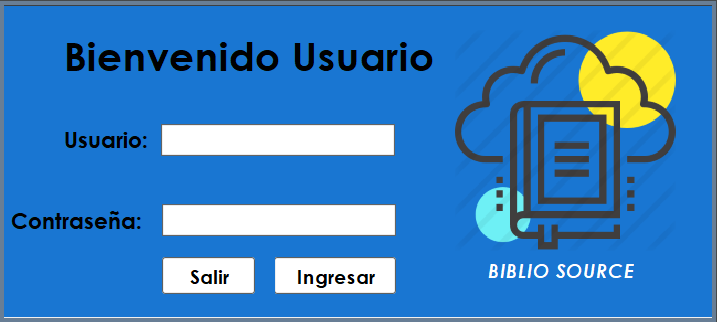
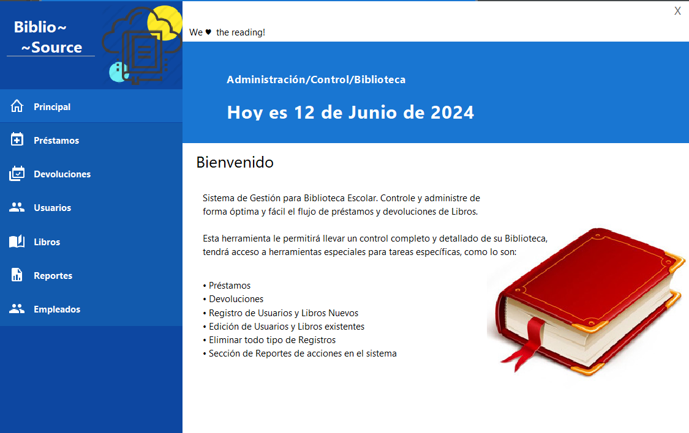
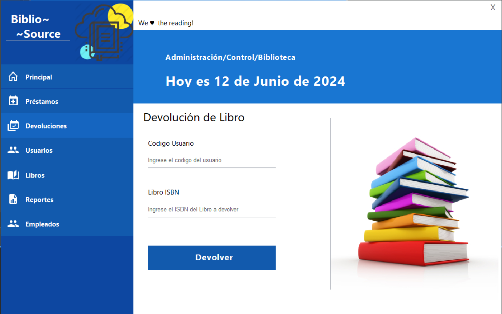
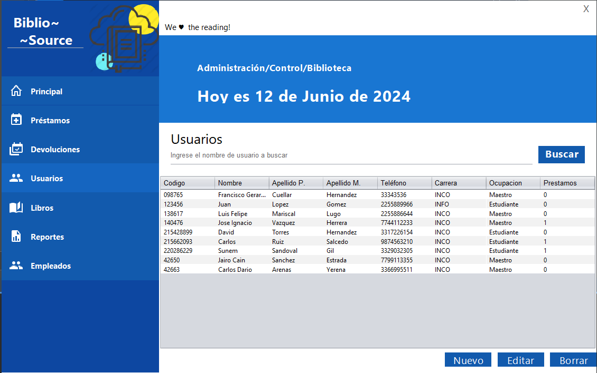
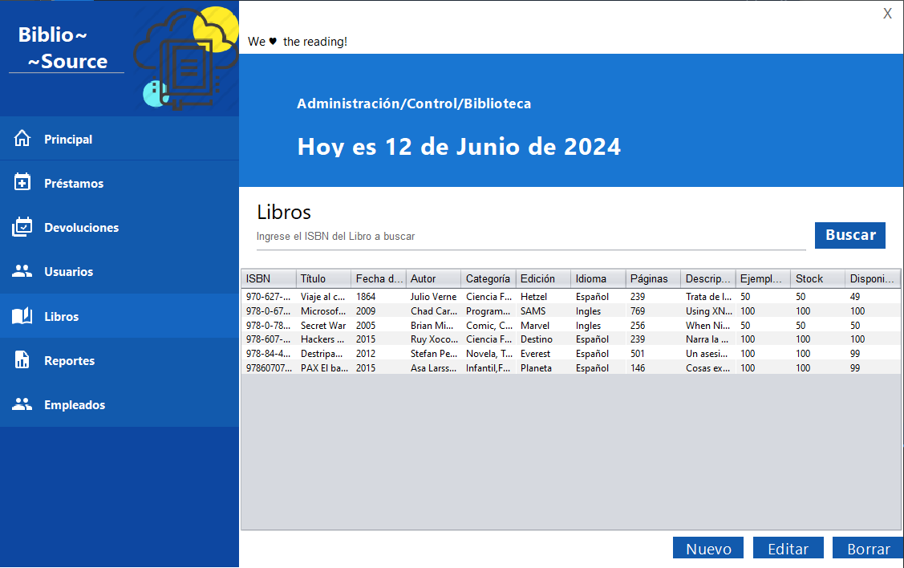
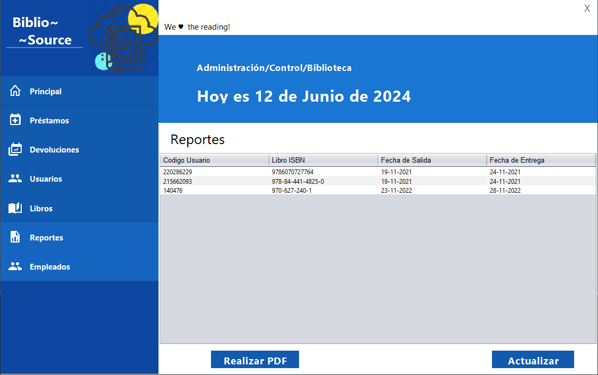
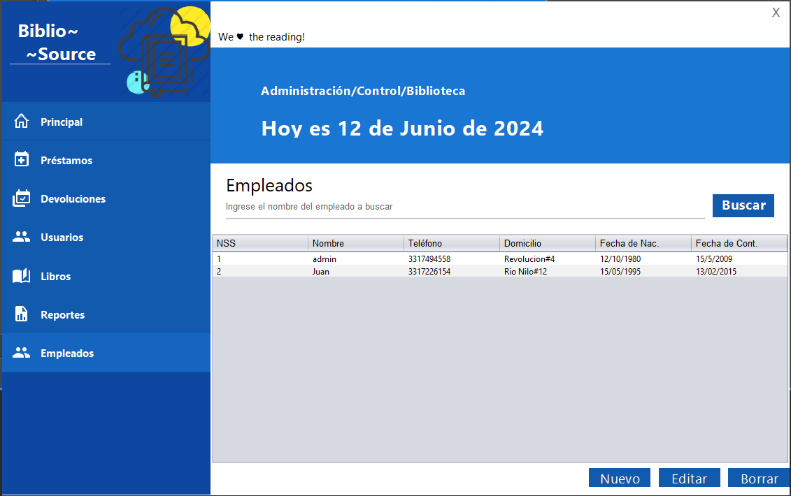

# Biblio-Source
Basic system for managing a library on Java. It's a school project that I did for Object Oriented Programming. Programmed in Java.

## Features
✔️ Graphic interface with Material Design style.\
✔️ Management of Leagues, Tournaments, Journeys, Teams, Coaches, Referees and Players.\
✔️ MySQL database connection.\
✔️ Management of books, loans and returns.\
✔️ Penalties for late returns.\
✔️ Movement logs.\
✔️ Lookup tables.

## Previews

  <kbd>
    </img>
    </img>
    </img>
    </img>
    </img>
    </img>
    </img>
    </img>
  </kbd>

## Getting Started
Import the java project in your preferred IDE and import the database. Just edit the class `Connect.class` with your database connection credentials.

### Important
Consider download the [mysql-connector-java-5.1.13](http://www.java2s.com/Code/JarDownload/mysql/mysql-connector-java-5.1.13.jar.zip) and import it to the project before compiling.
